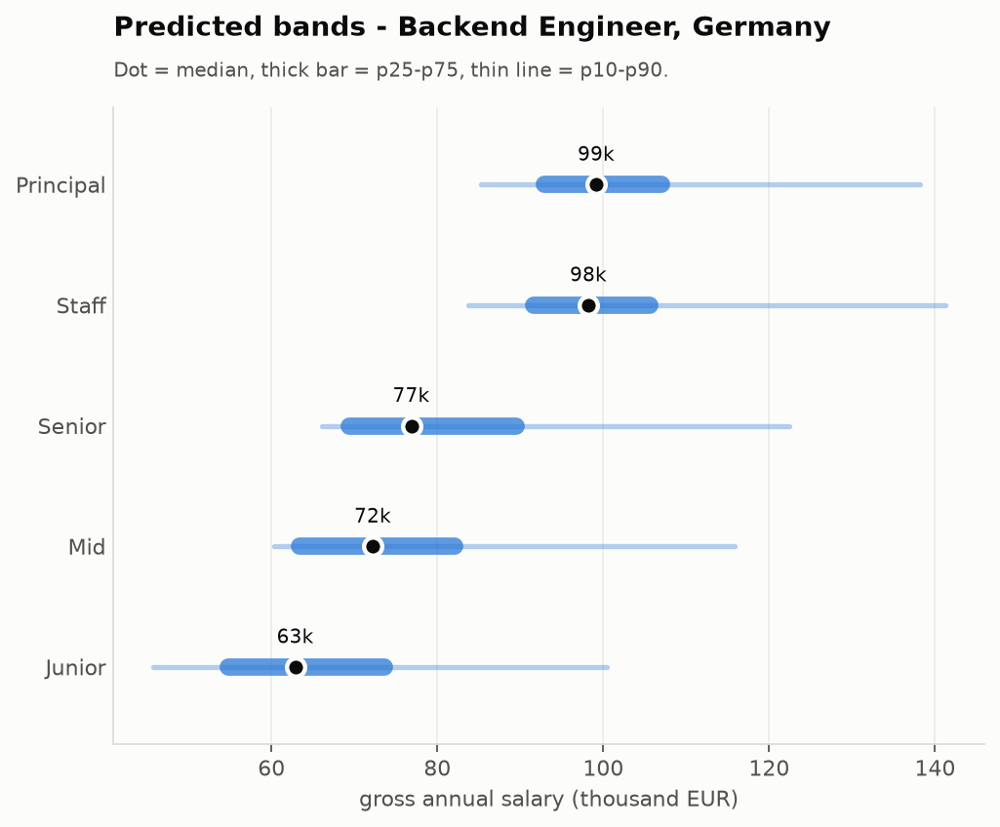
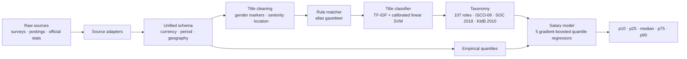
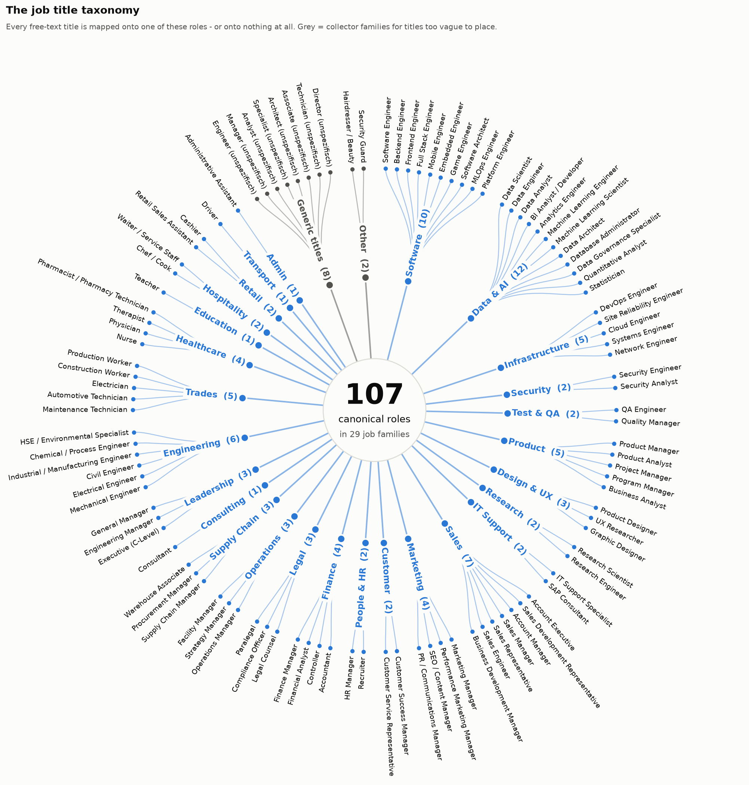
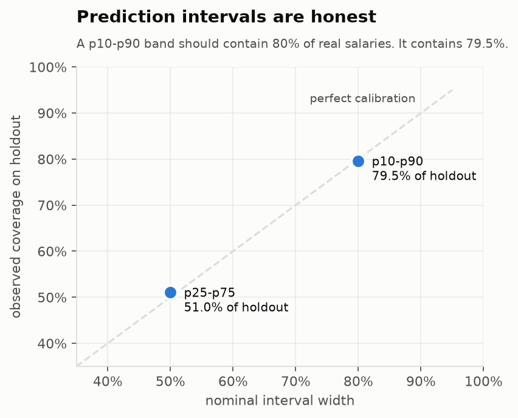
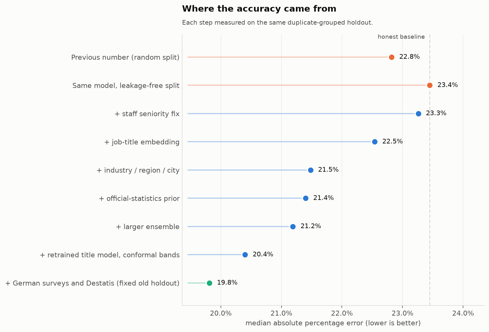
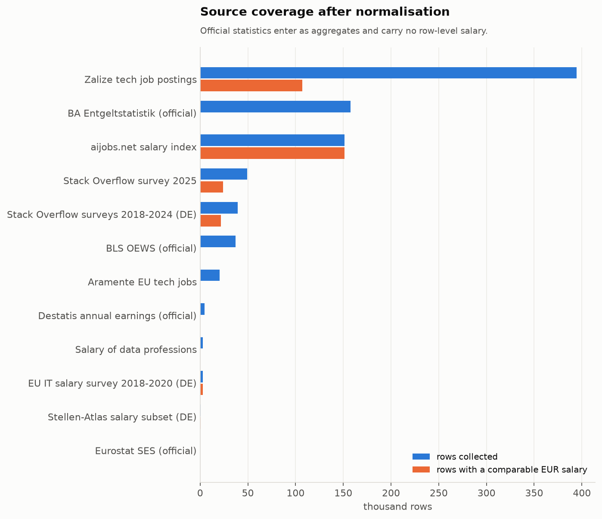

# salarykit

[](https://github.com/sayedmahmod/salary-predictor/actions/workflows/ci.yml)
[](LICENSE)
[](https://www.python.org/downloads/)
[](pyproject.toml)

**Turn messy, multi-source salary data into normalised job titles and calibrated
salary bands.**

salarykit reconciles eight public salary sources - developer surveys, job
postings and official government statistics - into a single schema, maps
free-text job titles onto a taxonomy of 107 roles in 29 job families, and
predicts conditional salary quantiles for a role in a place.

It answers *"what does this job pay, and how sure are we?"* - not with a single
number, but with a p10-p90 band and an explicit count of the evidence behind it.



> [!IMPORTANT]
> **No source data lives in this repository.** Raw downloads, derived datasets
> and any report quoting source text are excluded by `.gitignore`. The trained
> models are versioned: they carry fitted vocabularies and group-level
> aggregates, never row-level records. See [DATA_POLICY.md](DATA_POLICY.md).

---

## Contents

- [What it does](#what-it-does)
- [Installation](#installation)
- [Usage](#usage)
- [Model performance](#model-performance)
- [How it works](#how-it-works)
- [Data sources and attribution](#data-sources-and-attribution)
- [Building the dataset locally](#building-the-dataset-locally)
- [Repository layout](#repository-layout)
- [Limitations](#limitations)
- [Intended use](#intended-use)
- [Development](#development)
- [Model and data licensing](#model-and-data-licensing)

---

## What it does



- strips `(m/w/d)`, `:in`, `(all genders)` and similar gender markers
- extracts seniority, work model, contract type and any location in the title
- classifies **107 canonical roles** across **29 job families**
- links ISCO-08, SOC 2018 and KldB 2010 to official statistics
- unifies period, currency, country, region and city
- computes empirical salary quantiles with a fallback for small groups
- predicts p10, p25, median, p75 and p90 from title and context
- optionally places an existing salary as an approximate quantile

### The taxonomy at a glance

Every canonical role sits in exactly one job family:



The two grey branches are collector families: titles that are real but too vague
to place on a role - a bare "Engineer", "Manager" or "Specialist". They are kept
apart from the real families so they never quietly stand in for one.

## Installation

Python 3.11 or newer (scikit-learn is pinned to 1.9.0, which requires it):

```bash
python -m venv .venv
source .venv/bin/activate
python -m pip install -e '.[dev]'
```

The package itself needs only pandas, NumPy, PyArrow, openpyxl, scikit-learn and
joblib. `[plots]` adds matplotlib for the figures in this README; `[dev]` adds
pytest.

## Usage

### Normalise a job title

The rule layer works out of the box, with no trained model and no data build:

```bash
salarykit-title --no-model --pretty \
  "Sr. Softwareentwickler:in (m/w/d) - Muenchen, Vollzeit"
```

```python
from salarykit import JobTitlePredictor

result = JobTitlePredictor(use_model=False).predict(
    "Senior Data Scientist (all genders) - Berlin / Remote"
)
print(result.to_dict())
```

### Predict a salary band

Requires a local data build and a trained model (see
[Building the dataset locally](#building-the-dataset-locally)):

```bash
salarykit-salary "Senior Data Scientist (m/w/d)" \
  --location Berlin \
  --experience 7 \
  --remote-type hybrid \
  --current-salary-eur 90000
```

```json
{
  "normalized_job_title": "Data Scientist",
  "normalized_job_code": "data.scientist",
  "country_iso2": "DE",
  "region": "Berlin",
  "year": 2025,
  "seniority": "senior",
  "p10_annual_eur": 55047.60,
  "p25_annual_eur": 70462.97,
  "p50_annual_eur": 91539.71,
  "p75_annual_eur": 123097.62,
  "p90_annual_eur": 147553.06,
  "current_salary_eur": 90000.0,
  "current_salary_quantile": 0.4817,
  "support_level": "title_country_year",
  "support_n": 57,
  "support_sources": ["aijobs", "so_2025"],
  "supported": true
}
```

(abridged - the full output also carries the crosswalk codes, the USD median and
the parsed context.)

Two knobs matter most:

| Flag | Meaning |
|---|---|
| `--market-basis survey_response` | estimate a *reported actual* salary (default) |
| `--market-basis job_posting` | estimate an *advertised* salary band |
| `--industry "Software Development"` | narrow the estimate to an industry |

`support_level` and `support_n` say how much real evidence sits behind the
answer. When a title cannot be normalised confidently, the predictor returns
`supported: false` and no numbers rather than guessing. The output is a
statistical estimate, never an individual offer.

## Model performance

### Salary bands

Scored on a **duplicate-grouped holdout**: about 60% of rows are exact repeats of
`(title, country, salary)`, so a plain random split puts identical records on
both sides and the model recognises rather than predicts them. Rows sharing a key
are therefore kept on one side of the split.

| Metric | Value |
|---|---:|
| Training rows | 198,165 |
| Calibration rows | 21,485 |
| Holdout rows | 53,663 |
| Median absolute error | 22,632 EUR |
| Median absolute percentage error | 20.4% |
| R² on log(salary) | 0.664 |
| Mean pinball loss | 12,077 |
| Coverage of p25-p75 | 51.5% (nominal 50%) |
| Coverage of p10-p90 | 82.2% (nominal 80%) |

The bands are **conformalised**: independently trained quantile models only
approximate their nominal coverage, and a larger ensemble makes them sharp but
too narrow. A held-out calibration slice therefore fixes a per-pair widening that
pulls empirical coverage back onto its target - which is why both points below
sit on the diagonal instead of below it.



Each modelling decision, measured on that same holdout:



Reading that chart top to bottom: the figure the previous revision reported was
measured on a random split, which flattered it by 0.6 percentage points. Against
the honest baseline of **23.4%**, the current model cuts the error to **20.4%** -
a 13% relative improvement.

### Job title classification

| Metric | Previous | Current |
|---|---:|---:|
| Accuracy | 96.2% | 97.6% |
| Macro F1 | 94.7% | 96.5% |
| Artefact size | 86 MB | 22 MB |

These figures measure agreement with automatically generated (rule-matched)
labels on a held-out split, **not** with a human-annotated gold standard. They
say the model reproduces the rule layer's decisions on titles it has never seen;
they do not prove the taxonomy itself is right.

## How it works

### Title normalisation

Three layers, in order:

1. **clean** - remove gender markers, contract type, location, marketing fluff
2. **rule** - longest-match against an alias gazetteer
3. **model** - TF-IDF (word 1-2 grams + character 2-5 grams) into a calibrated
   linear SVM, for everything the rule layer does not know

Character n-grams suit short, multilingual job titles full of abbreviations and
German compounds: they connect "Softwareentwickler" / "Software Developer" /
"Sw Dev" through shared substrings, survive typos, and need no embedding
download. The classifier is trained by weak supervision - the rule matcher
labels what it recognises with confidence, and the model generalises from there
to the phrasings no rule covers.

Below a confidence of 0.45 the model abstains and the title stays `unmatched`,
which is why "Wizard of Light Bulb Moments" returns no salary rather than a
confident wrong one.

### Salary model

Five `HistGradientBoostingRegressor` quantile models on log annual EUR salaries.
Features:

- the taxonomy code, country, seniority, employment and remote type, record
  type, job family, industry, region and city, as categories
- year and years of experience, as numbers
- **a dense representation of the job title itself** - TF-IDF over word and
  character n-grams, reduced by SVD to 128 dimensions. The taxonomy code alone
  discards what is written in the title: "ML Engineer, LLM Infrastructure" and
  "ML Engineer" would otherwise land in the same bucket
- **an official-statistics prior** - the median for that role and country from
  the BA Entgeltstatistik and BLS OEWS aggregates, which anchors roles and
  countries where the microdata is thin

Established sources are balanced so one large posting source cannot dominate
the model. Smaller supplemental German sources use conservative source budgets,
and older survey rows receive a recency weight. Quantiles are trained independently and sorted afterwards,
which guarantees a valid distribution, and the resulting bands are then
conformalised on a held-out calibration slice so their coverage matches what they
claim.

`company_size` is deliberately **excluded**: it is a perfect source indicator -
aijobs writes `medium (50-250)`, the Stack Overflow survey uses numeric buckets,
the posting sources leave it empty - so the model would read the source from it
and inherit that source's salary level, and a caller cannot set it meaningfully
at prediction time anyway.

## Data sources and attribution

This project builds on public data from the following providers. **These credits
must stay visible in any published result derived from this pipeline.**

| Source | Licence | Attribution required |
|---|---|---|
| [Stack Overflow Developer Survey 2025](https://github.com/StackExchange/Survey/tree/main/packages/archive/2025) | ODbL 1.0, contents DbCL 1.0 | Yes, plus share-alike |
| [Stack Overflow Developer Surveys 2018-2024](https://github.com/StackExchange/Survey/tree/main/packages/archive) | ODbL 1.0, contents DbCL 1.0 | Yes, plus share-alike |
| [IT Salary Survey EU 2018-2020](https://www.kaggle.com/datasets/parulpandey/2020-it-salary-survey-for-eu-region) | CC0 1.0 | Not required, given anyway |
| [Stellen-Atlas / German Job Postings](https://huggingface.co/datasets/mischeiwiller/german-job-postings) | CC BY 4.0 | Yes, plus change notice |
| [aijobs.net Salary Index](https://github.com/foorilla/ai-jobs-net-salaries) | CC0 1.0 | Not required, given anyway |
| [Aramente/eu-tech-jobs](https://huggingface.co/datasets/Aramente/eu-tech-jobs) | CC BY 4.0 | Yes, plus change notice |
| [Zalize Tech Job Postings](https://huggingface.co/datasets/zalizedata/tech-job-postings-salary-dataset) | CC BY-NC 4.0 | Yes, **non-commercial only** |
| [Salary_of_Data_Professions](https://huggingface.co/datasets/krishujeniya/Salary_of_Data_Professions) | MIT per dataset card | Provenance unclear - not redistributed |
| [BA Entgeltstatistik](https://statistik.arbeitsagentur.de/DE/Navigation/Statistiken/Fachstatistiken/Beschaeftigung/Entgelt/Entgelt-Nav.html) | Datenlizenz Deutschland - Namensnennung 2.0 | Yes |
| [BLS OEWS](https://www.bls.gov/oes/tables.htm) | Public domain (U.S. Government) | Requested by the BLS |
| [Eurostat SES](https://ec.europa.eu/eurostat/web/labour-market/information-data/earnings) | Re-use with source acknowledgement | Yes, plus change notice |
| [Destatis Verdiensterhebung 62361-0034](https://genesis.destatis.de/datenbank/online/statistic/62361/table/62361-0034) | Datenlizenz Deutschland - Namensnennung 2.0 | Yes |

### Required notices

> - Contains information from the **Stack Overflow Developer Surveys 2018-2025**, made
>   available under the Open Database License (ODbL) 1.0; individual contents
>   under the Database Contents License (DbCL) 1.0.
> - Source: **aijobs.net** Global AI, ML and Data Science Salary Index (CC0 1.0).
> - Source: **IT Salary Survey for EU region 2018-2020** (CC0 1.0); Germany subset.
> - Source: **mischeiwiller/german-job-postings / Stellen-Atlas** (CC BY 4.0);
>   salary rows conservatively filtered and normalised.
> - Source: **Aramente/eu-tech-jobs** (CC BY 4.0); data cleaned and normalised.
> - **DataForge (data.zalize.com)**, Tech Job Postings Salary Dataset
>   (CC BY-NC 4.0); data cleaned and normalised.
> - Source: **Statistik der Bundesagentur für Arbeit**; transformed output.
> - Source: **U.S. Bureau of Labor Statistics**, Occupational Employment and Wage
>   Statistics; transformed output.
> - Source: **Eurostat**, Structure of Earnings Survey; transformed output.
> - Source: **Statistisches Bundesamt (Destatis)**, Verdiensterhebung,
>   table 62361-0034; transformed output.

Two constraints deserve special attention:

- **Zalize Tech Job Postings is CC BY-NC 4.0.** Any commercial use of a build
  that includes it is not permitted. The default fetch skips it.
- **The Stack Overflow survey is ODbL**, which carries a share-alike obligation
  on derived databases.

`scripts/fetch_salary_sources.sh` therefore skips the non-commercial and the
poorly-documented source unless you opt in explicitly. Levels.fyi and SOEP are
**not** included: both require an application, and this project contains no
scraped substitute. Details in [DATA_POLICY.md](DATA_POLICY.md) and
[data/SOURCES.md](data/SOURCES.md).



## Building the dataset locally

Read [DATA_POLICY.md](DATA_POLICY.md) before downloading anything.

```bash
bash scripts/fetch_salary_sources.sh   # safe default: skips NC + unverified
salarykit-build                        # unify into data/processed/
python scripts/train_title_model.py    # title classifier
python scripts/train_salary_model.py   # salary quantile models
python scripts/make_plots.py           # regenerate the figures above
```

Train the title model **before** rebuilding the dataset and the salary model:
the title classifier labels the rows the rule layer cannot reach, so a better
title model produces better training labels downstream.

For a confirmed personal or academic use, opt into the restricted sources:

```bash
INCLUDE_NONCOMMERCIAL=1 INCLUDE_UNVERIFIED=1 bash scripts/fetch_salary_sources.sh
```

Partial build:

```bash
salarykit-build --source aijobs --source eurostat_ses --output-dir /tmp/demo
```

Local outputs:

| File | Contents |
|---|---|
| `observations.parquet` | survey responses and job postings |
| `aggregates.parquet` | BA, BLS, Eurostat and Destatis statistics |
| `quantiles.parquet` | empirical salary distributions |
| `job_title_taxonomy.parquet` | codes, labels, aliases and crosswalks |
| `manifest.json` | row counts, sources and validation |

The schema is described in [docs/SCHEMA.md](docs/SCHEMA.md); the numbers of the
current local build are in [docs/STATS.md](docs/STATS.md).

## Repository layout

```text
src/salarykit/
├── build.py          dataset build, source orchestration
├── schema.py         column definitions and validation
├── money.py          currency, period and FX normalisation
├── geo.py            country, region and city parsing
├── quantiles.py      empirical quantile groups with fallbacks
├── sources/          one adapter per data provider
├── titles/           cleaning, rule matcher, taxonomy, classifier
└── salary/           quantile model, prediction API, CLI
scripts/              build, train, predict, plot, repository check
tests/                unit tests
docs/                 schema, statistics, figures
models/               trained title and salary artefacts (versioned)
reports/              evaluation metrics behind the numbers in this README
```

## Limitations

Read this before trusting a number.

- **The training data is not representative.** It is skewed towards tech and
  towards the United States: 78.6% of usable salary rows are US and only 1.2%
  are German. Non-tech roles rest on far thinner evidence.
- **Because of that skew, German estimates read high.** The model puts a senior
  Data Scientist in Berlin near 92k EUR, while the pooled empirical median for
  that role in Germany is 75k (see [docs/STATS.md](docs/STATS.md)). Treat the
  empirical quantile tables as the reality check.
- **Surveys are self-selected** and job postings advertise a range rather than
  report a paid salary. `--market-basis` chooses which of the two you want, but
  neither is a census.
- **The intervals describe data dispersion, not certainty.** A p10-p90 band says
  where comparable observations fell, not where your offer will land.
- **Title accuracy is measured against rule-generated labels**, not a human gold
  standard.
- **Official statistics enter only as a prior**, at role and country level. They
  do not override the microdata.
- The model is descriptive and **not causal**. Changing an input does not tell
  you what a raise negotiation would yield.

## Intended use

SalaryKit is not intended for candidate ranking, automated hiring decisions,
individual compensation decisions or other consequential employment decisions.

It estimates a statistical distribution for a role in a place, from data that is
skewed towards tech and towards the United States. It says nothing about an
individual person, and its output is not an offer, a benchmark or advice.

## Development

```bash
python -m unittest discover -s tests -v
python scripts/check_repository.py
```

CI runs both on every push and pull request
([`.github/workflows/ci.yml`](.github/workflows/ci.yml)).

## Model and data licensing

The source code is licensed under the [MIT Licence](LICENSE).

The pretrained models, evaluation results and derived figures are **not**
covered by the MIT License. They are published solely for non-commercial
research, educational use and portfolio demonstration.

The models incorporate data from sources including the Zalize Tech Job Postings
Salary Dataset, licensed under CC BY-NC 4.0. No source-level or row-level data
is distributed in this repository.

Commercial users must retrain the models exclusively from commercially
compatible sources.

The required source notices below stay in force for every published result
derived from this pipeline. The full matrix is in
[DATA_POLICY.md](DATA_POLICY.md); the artefacts themselves carry the same terms
in [models/README.md](models/README.md).

> - Contains information from the **Stack Overflow Developer Survey 2025**, made
>   available under the Open Database License (ODbL) 1.0; individual contents
>   under the Database Contents License (DbCL) 1.0.
> - Source: **aijobs.net** Global AI, ML and Data Science Salary Index (CC0 1.0).
> - Source: **Aramente/eu-tech-jobs** (CC BY 4.0); data cleaned and normalised.
> - **DataForge (data.zalize.com)**, Tech Job Postings Salary Dataset
>   (CC BY-NC 4.0); data cleaned and normalised.
> - Source: **Statistik der Bundesagentur für Arbeit**; transformed output.
> - Source: **U.S. Bureau of Labor Statistics**, Occupational Employment and Wage
>   Statistics; transformed output.
> - Source: **Eurostat**, Structure of Earnings Survey; transformed output.
